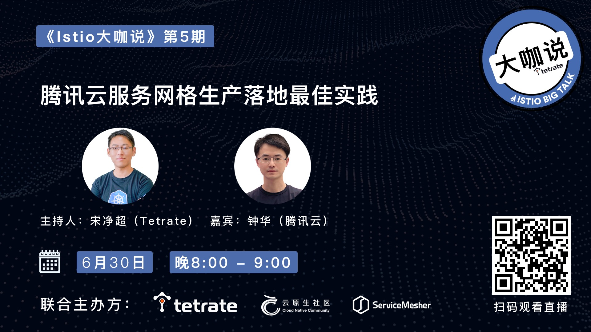

# Istio 大咖说第 5 期

- 分享时间：2021 年 6 月 30 日（周三）晚 8 点到 9 点
- 议题名称：腾讯云服务网格生产落地最佳实践
- 主持人：宋净超（Tetrate）
- 分享嘉宾：钟华（腾讯云）
- 直播间地址：<https://live.bilibili.com/23095515>
- 回放地址：<https://www.bilibili.com/video/BV1th411h7Zr/>
- 提问地址：<https://docs.qq.com/doc/DRUZSbHVkck9Wc0V4>
- PPT 下载：见 [Istio 大咖说往期节目列表](https://github.com/tetratelabs/istio-weekly)

钟华，腾讯云高级工程师，Istio contributor，Dapr contributor, Tencent Cloud Mesh 技术负责人。专注于容器和服务网格，在容器化、服务网格生产落地和性能调优方面具有丰富经验。

通过本次分享了解大规模场景下，Istio 性能调优和最佳实践，包括 xDS 懒加载，控制面负载平衡，控制面灰度升级，Ingress gateway 优化等。

### 分享大纲

1. Istio 生产落地挑战
2. 腾讯云服务网格全托管架构介绍
3. 大规模服务网格性能优化
4. Istio 生产落地最佳实践

### Q&A

1. Istio 的 gateway 对比 ambassador 的差异在哪？是否在 Istio 的基础上增加 api 网关这一层？增加后能填补哪些缺陷？

   答：Ambassador 本身也是基于 envoy 之上的一个云原生网关产品， 本身包括控制平面；api gateway 范畴包括一些 Istio ingress gateway 不具备的功能，比如 api 生命周期管理，api 计费，限速，监控，认证等。所以 api gateway 本身有存在的必要，不过 API Gateway 需求中很大一部分需要根据不同的应用系统进行定制。

   我们有客户将 kong， openresty 等 api gateway 和 Istio ingress gateway 结合起来用。

2. 对于多集群 Istio 部署了解到架构图如下所示，由单个控制平面管控所有集群，这里如果有 k8s 集群间网络不通，pod 与 pilot 交互链路是？

   答：数据面 k8s 间不互通，不会影响 控制面和数据面的通信。

   Istio 多集群的前提是：多 k8s 之间要互通，可以是 pod 扁平互通，或者通过 Istio gateway 互通。

3. Istio Envoy Sidecar 使用 iptables 劫持流量，一定规模环境下性能损耗较大，排障复杂，很多大厂都是自研 Envoy，比如蚂蚁金服、新浪、腾讯、华为等，自研的 Envoy 是使用什么来劫持流量呢，亦或者说自研的 envoy 解决了原生的 envoy 哪些缺陷呢？

   答：常见的有三种：

   1）uds：数据包不过协议栈，性能高，但只适合私有 mesh，因为需要应用面向 uds 编程。不适合公有云。比如美团，字节在使用这种方案。

   2）localhost+port：使用 port 代表不同的服务，通常需要拦截服务发现流量，再重新规划服务到端口映射，有一定管理成本，比如百度在使用这种方案。

   3）ebpf：在内核 socket ops 挂载 ebpf 程序，应用流量和 envoy 流量在 这个互通，流量不经过协议栈，性能高，对用户透明，但技术门槛高，对内核有版本要求。目前腾讯云 TCM 在小范围推广。

4. 长连接的情景下懒加载又是如何实现的？Workload 流量如何重定向到 egress，通过 passthrough？

   1）目前 lazy xds 对长连接没有特殊处理，用户需要权衡一下，首跳长连接性能 vs 数据面内存开销，以此决定是否使用长连接，大家如果对长连接 lazy xds 有想法，欢迎联系我。

   2）没有走 passthrough，请看 lazyxds 架构图上第二步，是会给 workload 2 下发具体的重定向规则，也就是指明哪些服务流量要到 lazy egress。

5. 钟老师您好， Istio 属于较新的技术，能否推荐一下监控应该怎么做， 或具体监控哪些指标？ 另外，下图步骤 10， Istiod 更新的时候是全量所有 workload 都更新吗， 还是只更新 wordload1 ?

   1）mesh 监控包括三个方面：metric, tracing，logging, TCM 技术选型偏云原生：metric 使用 prometheus, tracing 使用 jaeger collector， logging 是自研的技术。另外也用到了腾讯云上的监控服务。

   2）只更新 workload1，注意架构图上的第八，sidecar 里会指定具体的 workload。

6. Istio 目前的性能优化有什么实践经验吗

   答：TCM 团队之前在 kubeconf 上有数据面性能分享，请参考：[深入了解服务网格数据平面性能和调优](https://cloud.tencent.com/developer/article/1685873)。

7. 请问 isitod 的稳定性有什么实践经验可以分享吗，failback，failover 容错机制是怎么实现的？

   1. 本次分享包括 2 个 Istiod 稳定性实践：如何保证 Istiod 负载平衡，如何对 Istiod 做灰度升级
   2. 数据面 failback，failover 本身是 envoy 的能力，Istio 会给 eds 设置 priority， 这个值表示和当前 pod 的亲和度（地域和区域），（如果开启就近访问）服务访问会优先访问 priority 为 0 的 endpoint， 如果为 0 的 endpoint 都失效了，访问会 failover 到 priority 为 1 的 endpoint，接下来是 priority 为 2 的，逐级失效转移。

8. Istio 与已有的基础设施 (注册中心等) 如何整合，是使用 mcp 还是 k8s api server 实现

   答：之前我们尝试过 mcp，不过比较难调试，目前我们更推荐使用扩展 service entry 方式，参考我们开源的 [dubbo2istio](https://github.com/aeraki-framework/dubbo2istio) 或 [consul2istio](https://github.com/aeraki-framework/consul2istio)。

9. TKE 注入 sidecar pod 会从 1 个容器升级为 2 个容器，请问 pod 对集群内其他 pod 访问的链路是怎么走的呢？ 20:28 说到控制面板资源 HPA 后依然会紧张，能否建议下 ISTIOD 的资源应该如何设计么， 比如 n 个 pod 对应 1 个 Istiod。

   1. client 业务容器 ->client pod iptables->client envoy （将 service ip 转成 pod ip） -> node (iptables 不做 service nat 了) -> server pod iptables-> server envoy -> server 业务容器
   2. 需要结合业务做压测，通常建议可以把 request 设小一点，把 limit 设大一点。

10. isito 的部署模型是怎么样的？是每个业务部署一个 isitod 集群，还是多个业务共享？

    答：TCM 托管场景下，每个 mesh 有一个 Istiod。Istiod 按照 namespace 隔离。

11. namespace 是如何划分的，是按照业务来划分吗？

    答：TCM 场景下，是的，通过 namespace 隔离多租户的控制面。

12. Istio 使用 envoyFilter 做限流，可以在 inbound 上根据 url 前缀匹配或者接口级别的维度做限流么？目前看只能在 outbound 上引用 virtualService 里面的配置，inbound 只能限制总流量。

    答：目前社区应该不支持 url 级别的限流，需要自研。这个需求是刚需，我们可以一起调研下解决方案。

13. CRD 托管的原理能详细介绍下吗？

    答：核心使用的是 kubernetes aggregation 技术，把 Istio CRD 作为 kubernetes 的外部扩展。

    当用户读写 Istio crd 时， api server 会将流量路由到我们指定的外部服务，我们这外部服务实现了 crd 的托管。

14. Envoy 如何做热更新？怎么在容器内注入新版本的 Envoy？

    答：热更新核心是通过 UDS（UNIX Domain Socket），可以参考下 openkruise 解决方案，不过该方案只能解决仅有镜像版本变化的更新，对于 yaml 变化太大的更新，目前不好处理。

15. 业务容器已经启动接收流量了，而 envoy 还没完成 eds 的下发，出现流量损失？Istio 是否会出现这种情况？

    答：会的，所以需要遵循 make before break，核心原因在于：目前 Istio 实现中，没法知道 规则下发是否完全生效。

    目前的姑息办法是 make before break + 等待一定时间。

16. 如何支持 `subdomain-*.domain.com` 这样的 host 规则？Envoy 是不支持的，有没有方法可以扩展

    答：目前的确不支持，建议去社区提 issue，参与共建。不过 Istio 的 header match 支持正则，可以尝试使用 host header，或者 authority 属性，需要验证一下。

17. Istio 可否实现类似于 dubbo 服务的 warmup 机制，动态调整新注册 pod 的流量权重由低到正常值？ZPerling

    答：Envoy 社区有提案，目前没有完成：[issue #11050](https://github.com/envoyproxy/envoy/issues/11050) 和 [issue 13176](https://github.com/envoyproxy/envoy/pull/13176)。

18. Mysql 和 mq 可以做版本流量控制吗？他们的流量识别怎么做呢？

    答：目前不行，这是 Istio 的软肋，envoy mysql filter 功能比较基础，关注下 Dapr 这个项目。

19. 原来的 SpringCloud 项目 服务注册发现 & 配置中心用的 consul，如果切换 Istio 的话，服务发现和配置中心要怎么支持？

    答：注册发现考虑下 [consul2istio](https://github.com/aeraki-framework/consul2istio)，另外 SpringCloud 组件可能需要做一些减法，去掉一些 Istio 支持的流控能力组件。

20. SpringCloud 项目 通过 K8s 集群部署，切换到 Istio，原来业务依赖的中间件通信方式需要改变？原本的流量如果直接切换到 Istio 风险较高，有没有一键下掉 Istio 的开关或者这种机制：降低有问题流量降级切换到原来的部署架构？

    1）可能改变的通信方式：主要是服务发现过程改变。Istio 支持透明接入，通常中间件的通信方式不会受影响。

    2）这个能力的确会给刚开始 mesh 化的业务带来信心，开源 Istio 没有这个能力，参考之前百度陈鹏的分享。

21. 使用 traefik 作为边缘代理，Istio 来管理服务内部的流量。traefik 转发策略是直连 pod，而不是走 k8s 的 service，如何使用 Istio 来管理到达服务的流量？

    答：抱歉我对 traefik 并不熟悉，不过大概看了这篇[在 Istio 服务网格中使用 Traefik Ingress Controller](https://cloudnative.to/blog/using-traefik-ingress-controller-with-istio-service-mesh/)，流量从 traefik 出来是经过了 envoy，在这里应该还可以做服务治理，后面我再研究下。

22. 目前 Istio 版本缺失限流功能，这部分要怎么支持？

    答：目前 Istio 支持 local 和 global 两种方式，不过 local 无法多 pod 共享限频次数，global 性能可能不一定满足用户需求。

    目前社区应该不支持 url 级别的限流，需要自研。这个需求是刚需，我们可以一起调研下解决方案。

23. 现有 K8S 集群业务切换到腾讯云 Istio 部署需要做哪些操作？成本高？

    答：看当前业务的技术特征，如果是 http、grpc+ k8s 服务发现，迁移成本比较低，如果有私有协议，会有一定难度。

24. 是一套 k8s 对应一套 Istio，还是一套 Istio 对应多个 k8s 集群？多集群是怎么做的？

    1. 主要看业务需求，如果有跨集群业务互访，或者跨集群容灾，就可以考虑使用 Istio 多集群方案。
    2. 多集群实现可以参考我之前的分享：[Istio 庖丁解牛 (五) 多集群网格实现分析](https://zhonghua.io/2019/07/29/istio-analysis-5/) 和 [istio 庖丁解牛 (六) 多集群网格应用场景](https://zhonghua.io/2019/08/01/istio-analysis-6/)。

25. Istio 下的服务限流方案？

    答：目前支持 local 和 global 两种方式，参考 [Enabling Rate Limits using Envoy](https://istio.io/latest/docs/tasks/policy-enforcement/rate-limit/)，另外网易 slime 中有动态的限流方案。

26. Istio 到现在都不支持 path rewrite 的正则，这块是否有一些社区的方案支持，因为这个策略在实际的业务中还是很常见的

    答：目前的确不支持，建议去社区提 issue，参与共建。

27. 多网络单控制平面的情况下，从集群如果没有某服务的 Pod 的话，该集群其他 Pod 通过域名访问主集群 pod 的话从集群必须有空的 svc 吗，有其他什么方案实现吗 智能 dns 方案成熟了吗？Pilot Agent 不是有 DNS Proxy 么

    答：Istio 1.8 提供的 智能 DNS 可以解决这个问题，1.8 里有 bug， 1.9 修复了，目前我们有生产客户在用了，目前看起来生产可用，可以尝试。

28. 切换到 istio, 原来业务依赖的中间件通信方式需要改变？MySQL Redis Consul Kafka

    答：Istio 对 db mesh 支持功能不多，通信方式不需要改变。

29. 推荐使用哪个版本的 Istio？

    答：建议使用次新版本，比如现在 1.10 发布了，建议使用 1.9；未来 1.11 发布了，就要着手升级到 1.10。